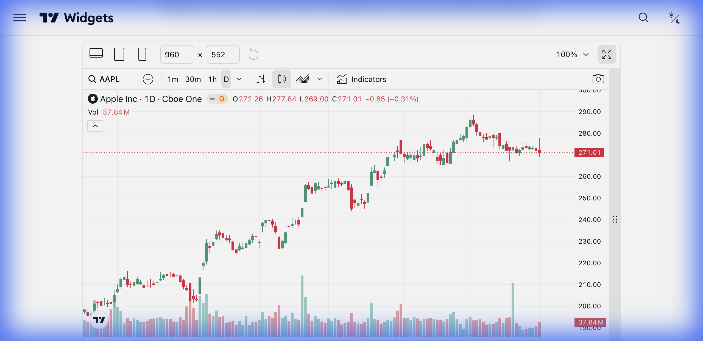

# 📈 Advanced Chart (Gráfico Avançado)



> **Categoria:** Charts  
> **Tipo:** Gráfico Interativo Completo  
> **Script URL:** `embed-widget-advanced-chart.js`

---

## O que apresenta

O widget de gráfico mais completo do TradingView. Permite análise técnica profissional com:
- Gráficos de candlestick, linha, área, barras, Heikin Ashi, etc.
- 100+ indicadores técnicos (MACD, RSI, Bollinger, etc.)
- Ferramentas de desenho (linhas, Fibonacci, ondas de Elliott)
- Múltiplos timeframes (1min a 1M)
- Comparação de múltiplos ativos no mesmo gráfico
- Watchlist lateral integrada

---

## Contextos de Dados Possíveis

| Contexto | Exemplo de Símbolo | Notas |
|----------|-------------------|-------|
| 🇧🇷 Ações B3 | `BMFBOVESPA:PETR4` | Ações brasileiras (Petrobras, Vale, etc.) |
| 🇺🇸 Ações EUA | `NASDAQ:AAPL` | Ações americanas |
| 💱 Forex | `FX:EURUSD` | Pares de moedas (EUR/USD, USD/BRL) |
| ₿ Crypto | `BINANCE:BTCUSDT` | Criptomoedas em diversas exchanges |
| 📊 Índices | `INDEX:IBOV` | Índices globais (IBOV, S&P500) |
| 📈 Futuros | `CME:ES1!` | Contratos futuros |
| 📦 ETFs | `AMEX:SPY` | Fundos de índice |
| 🌾 Commodities | `TVC:GOLD` | Ouro, Petróleo, Soja, etc. |

---

## Casos de Uso no Lens/Terminal

```
// CONTEXTO: Usuário pergunta "Como está o PETR4 hoje?"
→ Gerar Advanced Chart com BMFBOVESPA:PETR4, timeframe 1D

// CONTEXTO: Usuário quer comparar VALE3 vs PETR4
→ Gerar Advanced Chart com ambos símbolos em modo comparativo

// CONTEXTO: Análise técnica profunda
→ Gerar Advanced Chart com indicadores pré-configurados (RSI, MACD, Bandas)

// CONTEXTO: Educacional - mostrar o que é um padrão de candle
→ Gerar Advanced Chart com zoom em padrões específicos
```

---

## Parâmetros Principais

| Parâmetro | Tipo | Descrição |
|-----------|------|-----------|
| `symbol` | string | Símbolo do ativo (ex: "BMFBOVESPA:PETR4") |
| `interval` | string | Timeframe: "1", "5", "15", "60", "D", "W", "M" |
| `timezone` | string | Fuso horário (ex: "America/Sao_Paulo") |
| `theme` | string | "light" ou "dark" |
| `style` | number | 0=Bars, 1=Candles, 2=Line, 3=Area, etc. |
| `locale` | string | Idioma (ex: "br" para português) |
| `studies` | array | Lista de indicadores a exibir |
| `hide_side_toolbar` | bool | Ocultar ferramentas laterais |
| `allow_symbol_change` | bool | Permitir trocar símbolo |
| `watchlist` | array | Lista de símbolos para watchlist lateral |

---

## Demo Oficial

- [Analytics Platform](https://www.tradingview.com/widget-docs/widgets/charts/advanced-chart/demos/analytics-platform)
- [Basic Area Chart](https://www.tradingview.com/widget-docs/widgets/charts/advanced-chart/demos/basic-area-chart)
- [Technical Analysis](https://www.tradingview.com/widget-docs/widgets/charts/advanced-chart/demos/technical-analysis)
- [Watchlist](https://www.tradingview.com/widget-docs/widgets/charts/advanced-chart/demos/watchlist)

---

## Referência

[Documentação Oficial](https://www.tradingview.com/widget-docs/widgets/charts/advanced-chart)
