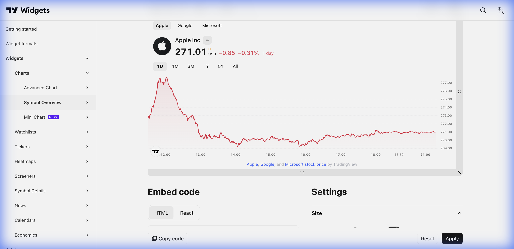

# 📊 Symbol Overview (Visão Geral do Símbolo)



> **Categoria:** Charts  
> **Tipo:** Mini-gráfico com Informações  
> **Script URL:** `embed-widget-symbol-overview.js`

---

## O que apresenta

Widget compacto que combina um mini-gráfico com informações essenciais do ativo:
- Preço atual e variação (% e absoluta)
- Mini-gráfico de área ou linha
- Seletor de período (1D, 1W, 1M, 3M, 6M, 1Y)
- Nome da empresa e símbolo

---

## Contextos de Dados Possíveis

| Contexto | Exemplo de Símbolo | Notas |
|----------|-------------------|-------|
| 🇧🇷 Ações B3 | `BMFBOVESPA:VALE3` | Ações brasileiras |
| 🇺🇸 Ações EUA | `NYSE:KO` | Ações americanas |
| 💱 Forex | `FX:USDBRL` | Ideal para mostrar dólar vs real |
| ₿ Crypto | `BINANCE:ETHUSDT` | Criptomoedas |
| 📊 Índices | `TVC:SPX` | Índices globais |

---

## Casos de Uso no Lens/Terminal

```
// CONTEXTO: Preview rápido de ativo no feed
→ Mostrar Symbol Overview compacto dentro de cards

// CONTEXTO: Comparar múltiplos ativos lado a lado
→ Gerar 4 Symbol Overviews: PETR4, VALE3, ITUB4, BBDC4

// CONTEXTO: Mostrar câmbio USD/BRL na tela inicial
→ Symbol Overview com FX:USDBRL

// CONTEXTO: Índices overview (vertical layout)
→ Mostrar IBOV, S&P500, Nasdaq empilhados verticalmente
```

---

## Parâmetros Principais

| Parâmetro | Tipo | Descrição |
|-----------|------|-----------|
| `symbols` | array | Lista de símbolos com nomes |
| `chartOnly` | bool | Mostrar apenas gráfico (sem dados) |
| `width` | string | Largura (ex: "100%") |
| `height` | number | Altura em pixels |
| `locale` | string | Idioma |
| `colorTheme` | string | "light" ou "dark" |
| `isTransparent` | bool | Fundo transparente |
| `dateRange` | string | Período padrão (ex: "12M") |
| `showVolume` | bool | Mostrar volume |
| `showMA` | bool | Mostrar média móvel |

---

## Modos de Exibição

1. **Horizontal (padrão)**: Gráfico e dados lado a lado
2. **Vertical**: Gráfico em cima, dados embaixo
3. **Comparison**: Múltiplos ativos no mesmo gráfico
4. **Technical Chart**: Com indicadores de análise técnica

---

## Demo Oficial

- [Indices Overview](https://www.tradingview.com/widget-docs/widgets/charts/symbol-overview/demos/indices-overview)
- [Vertical Chart](https://www.tradingview.com/widget-docs/widgets/charts/symbol-overview/demos/vertical-chart)
- [Technical Analysis Chart](https://www.tradingview.com/widget-docs/widgets/charts/symbol-overview/demos/technical-chart)
- [Comparison Chart](https://www.tradingview.com/widget-docs/widgets/charts/symbol-overview/demos/compare)

---

## Referência

[Documentação Oficial](https://www.tradingview.com/widget-docs/widgets/charts/symbol-overview)
