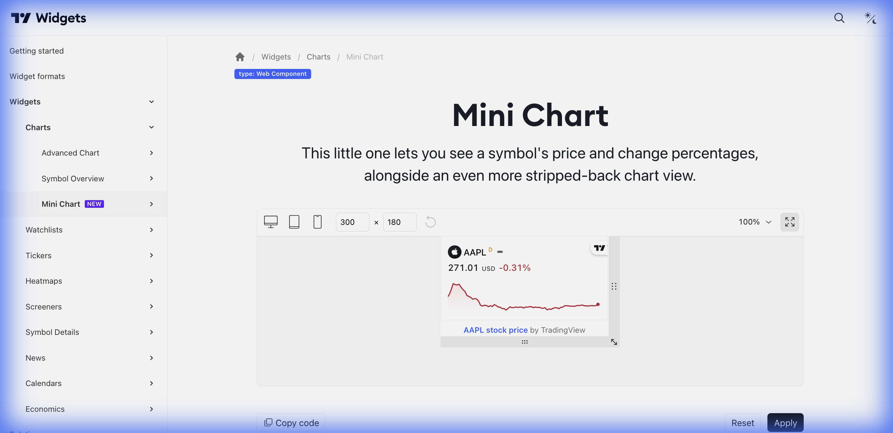

# 📉 Mini Chart (Mini Gráfico)



> **Categoria:** Charts  
> **Tipo:** Gráfico Compacto  
> **Script URL:** `embed-widget-mini-symbol-overview.js`

---

## O que apresenta

O widget mais compacto de gráfico. Ideal para:
- Cards de preview de ativos
- Listas com muitos itens
- Tickers laterais
- Displays minimalistas

Mostra:
- Nome do símbolo
- Preço atual
- Variação percentual
- Mini gráfico de área

---

## Contextos de Dados Possíveis

| Contexto | Exemplo de Símbolo | Notas |
|----------|-------------------|-------|
| 🇧🇷 Ações B3 | `BMFBOVESPA:MGLU3` | Ações brasileiras em listas |
| 🇺🇸 Ações EUA | `NASDAQ:MSFT` | Ações americanas |
| 💱 Forex | `FX:EURUSD` | Pares de moedas |
| ₿ Crypto | `BINANCE:BTCUSDT` | Criptomoedas |
| 📊 Índices | `INDEX:IBOV` | Índices |

---

## Casos de Uso no Lens/Terminal

```
// CONTEXTO: Grid de ações na home
→ Gerar múltiplos Mini Charts em grid 4x3

// CONTEXTO: Lista de ativos do radar
→ Mini Chart para cada ativo da lista salva

// CONTEXTO: Comparativo rápido de desempenho
→ Mini Charts de 5 ativos lado a lado

// CONTEXTO: Widget de carteira
→ Mini Chart para cada posição do usuário
```

---

## Parâmetros Principais

| Parâmetro | Tipo | Descrição |
|-----------|------|-----------|
| `symbol` | string | Símbolo do ativo |
| `width` | number/string | Largura |
| `height` | number | Altura (recomendado: 180-250px) |
| `locale` | string | Idioma |
| `dateRange` | string | Período (ex: "12M") |
| `colorTheme` | string | "light" ou "dark" |
| `trendLineColor` | string | Cor da linha do gráfico |
| `underLineColor` | string | Cor do preenchimento |
| `isTransparent` | bool | Fundo transparente |
| `largeChartUrl` | string | URL para abrir gráfico maior ao clicar |

---

## Dica de Implementação

O parâmetro `largeChartUrl` é crucial para o fluxo de navegação:
- Configure para redirecionar ao clicar
- Passa o símbolo automaticamente via `?tvwidgetsymbol=`

```javascript
"largeChartUrl": "https://seusite.com/analysis.html"
// Ao clicar → https://seusite.com/analysis.html?tvwidgetsymbol=BMFBOVESPA:PETR4
```

---

## Demo Oficial

- [Gallery](https://www.tradingview.com/widget-docs/widgets/charts/mini-chart/gallery)

---

## Referência

[Documentação Oficial](https://www.tradingview.com/widget-docs/widgets/charts/mini-chart)
