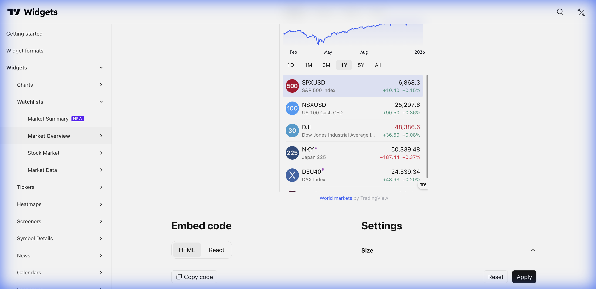

# 📊 Market Overview (Visão Geral do Mercado)



> **Categoria:** Watchlists  
> **Tipo:** Lista com Gráfico Interativo  
> **Script URL:** `embed-widget-market-overview.js`

---

## O que apresenta

Widget principal para listas de ativos. Combina:
- Lista lateral de símbolos com preço e variação
- Gráfico maior do item selecionado
- Navegação por abas (customizáveis)
- Click para expandir (largeChartUrl)

É o **widget mais versátil** para criar grades de ativos.

---

## Contextos de Dados Possíveis

| Contexto | Exemplo de Configuração | Notas |
|----------|------------------------|-------|
| 🇧🇷 Ações B3 | Aba "Ações" com PETR4, VALE3, ITUB4... | Lista customizável |
| 💱 Forex | Aba "Moedas" com USD/BRL, EUR/USD... | Para produto Dólar |
| ₿ Crypto | Aba "Cripto" com BTC, ETH, SOL... | Mercado cripto |
| 📊 Índices | Aba "Índices" com IBOV, SPX, NDX... | Visão macro |
| 🎯 Carteira | Aba com ativos do usuário | Listas personalizadas |

---

## Casos de Uso no Lens/Terminal

```
// CONTEXTO: Home principal - grade de ações
→ Market Overview com aba "Ações B3" contendo lista do stocks.txt

// CONTEXTO: Radar - lista curada "Dividendos"
→ Market Overview com ativos que pagam dividendos

// CONTEXTO: Comparativo de setores
→ Abas: "Bancos", "Petróleo", "Varejo", "Tech"

// CONTEXTO: Produto Fluxo (Fundos)
→ Market Overview com ETFs e fundos indexados
```

---

## Parâmetros Principais

| Parâmetro | Tipo | Descrição |
|-----------|------|-----------|
| `tabs` | array | Array de abas, cada uma com título e símbolos |
| `width` | string | Largura |
| `height` | number | Altura |
| `colorTheme` | string | "light" ou "dark" |
| `locale` | string | Idioma |
| `isTransparent` | bool | Fundo transparente |
| `showChart` | bool | Mostrar gráfico |
| `dateRange` | string | Período do gráfico (ex: "12M") |
| `largeChartUrl` | string | URL ao clicar no símbolo |

---

## Estrutura de Abas

```javascript
"tabs": [
  {
    "title": "Ações B3",
    "symbols": [
      { "s": "BMFBOVESPA:PETR4", "d": "Petrobras" },
      { "s": "BMFBOVESPA:VALE3", "d": "Vale" }
    ]
  },
  {
    "title": "Forex",
    "symbols": [
      { "s": "FX:USDBRL", "d": "Dólar/Real" }
    ]
  }
]
```

---

## Demo Oficial

- [Stocks](https://www.tradingview.com/widget-docs/widgets/watchlists/market-overview/demos/stock)
- [Indices](https://www.tradingview.com/widget-docs/widgets/watchlists/market-overview/demos/indices)
- [Forex](https://www.tradingview.com/widget-docs/widgets/watchlists/market-overview/demos/forex)
- [Cryptocurrencies](https://www.tradingview.com/widget-docs/widgets/watchlists/market-overview/demos/crypto)

---

## Referência

[Documentação Oficial](https://www.tradingview.com/widget-docs/widgets/watchlists/market-overview)
