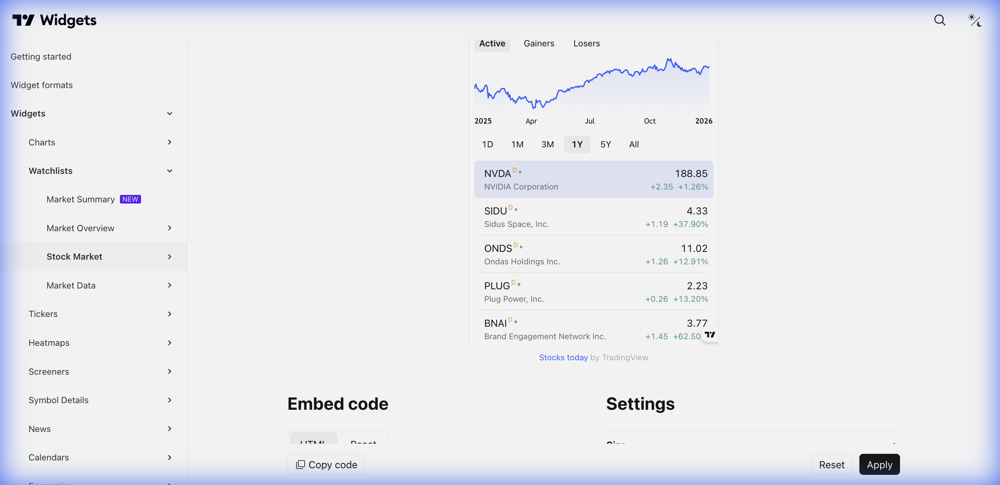

# 🏛️ Stock Market (Mercado de Ações)



> **Categoria:** Watchlists  
> **Tipo:** Lista Especializada em Ações  
> **Script URL:** `embed-widget-stock-market.js`

---

## O que apresenta

Widget focado em ações de uma bolsa específica. Mostra:
- Lista de ações com preço, variação, volume
- Gráfico do ativo selecionado
- Hot lists: maiores altas, maiores quedas, mais negociadas
- Filtro por setor

---

## Contextos de Dados Possíveis

| Contexto | Bolsa | Notas |
|----------|-------|-------|
| 🇧🇷 B3 | BMFBOVESPA | Ações brasileiras |
| 🇺🇸 NYSE | NYSE | Ações americanas (Bolsa de NY) |
| 🇺🇸 NASDAQ | NASDAQ | Ações de tecnologia |
| 🇪🇺 Europa | LSE, XETR, EURONEXT | Bolsas europeias |
| 🌏 Ásia | TSE, HKEX, SSE | Bolsas asiáticas |

---

## Casos de Uso no Lens/Terminal

```
// CONTEXTO: Radar de ações brasileiras
→ Stock Market widget com BMFBOVESPA

// CONTEXTO: Maiores altas do dia
→ Stock Market com "Hot Lists" ativo (maiores altas)

// CONTEXTO: Ações por setor
→ Stock Market filtrado por "Bancos" ou "Petróleo"

// CONTEXTO: Tela de descoberta
→ Stock Market com "Mais negociadas" em destaque
```

---

## Parâmetros Principais

| Parâmetro | Tipo | Descrição |
|-----------|------|-----------|
| `exchange` | string | Bolsa (ex: "BMFBOVESPA") |
| `width` | string | Largura |
| `height` | number | Altura |
| `colorTheme` | string | "light" ou "dark" |
| `locale` | string | Idioma |
| `showChart` | bool | Mostrar gráfico lateral |
| `largeChartUrl` | string | URL ao clicar |

---

## Demo Oficial

- [Brazil Stocks Overview](https://www.tradingview.com/widget-docs/widgets/watchlists/stock-market/demos/brazil-exchange)
- [Customized Widget](https://www.tradingview.com/widget-docs/widgets/watchlists/stock-market/demos/customized-stock-widget)
- [Hot Lists](https://www.tradingview.com/widget-docs/widgets/watchlists/stock-market/demos/no-chart)

---

## Referência

[Documentação Oficial](https://www.tradingview.com/widget-docs/widgets/watchlists/stock-market)
