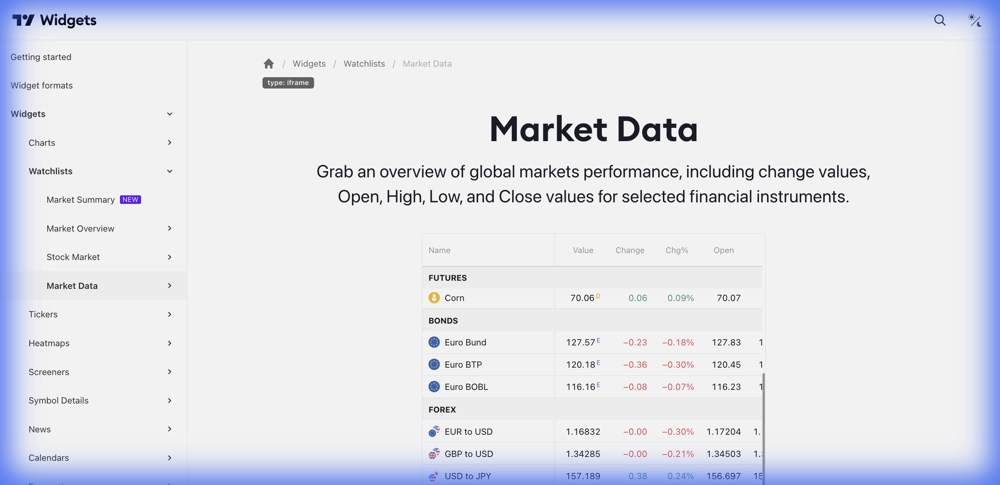

# 📈 Market Data / Market Quotes (Cotações)



> **Categoria:** Watchlists  
> **Tipo:** Tabela de Cotações  
> **Script URL:** `embed-widget-market-quotes.js`

---

## O que apresenta

Widget de tabela de cotações em tempo real. Exibe:
- Símbolo e nome
- Último preço
- Variação (% e absoluta)
- Volume
- Máxima/Mínima do dia
- Sparkline (mini-gráfico)

É a forma mais **densa** de mostrar múltiplos ativos.

---

## Contextos de Dados Possíveis

| Contexto | Exemplo | Notas |
|----------|---------|-------|
| 🇧🇷 Ações B3 | PETR4, VALE3, ITUB4... | Lista customizável |
| 📊 Índices | IBOV, S&P500, Nasdaq... | Índices globais |
| 📈 Futuros | ES, NQ, CL, GC... | Contratos futuros |
| 💱 Forex | EUR/USD, USD/BRL... | Pares de moedas |
| ₿ Crypto | BTC, ETH, SOL... | Criptomoedas |

---

## Casos de Uso no Lens/Terminal

```
// CONTEXTO: Tabela de cotações na home
→ Market Quotes com principais ações B3

// CONTEXTO: Painel de futuros
→ Market Quotes com contratos de commodities

// CONTEXTO: Radar salvo do usuário
→ Market Quotes com lista personalizada

// CONTEXTO: Comparativo de moedas
→ Market Quotes com múltiplos pares FX
```

---

## Parâmetros Principais

| Parâmetro | Tipo | Descrição |
|-----------|------|-----------|
| `symbols` | array | Lista de símbolos |
| `width` | string | Largura |
| `height` | number | Altura |
| `colorTheme` | string | "light" ou "dark" |
| `locale` | string | Idioma |
| `showSymbolLogo` | bool | Mostrar logo da empresa |
| `isTransparent` | bool | Fundo transparente |

---

## Demo Oficial

- [Stocks](https://www.tradingview.com/widget-docs/widgets/watchlists/market-quotes/demos/stock)
- [Indices](https://www.tradingview.com/widget-docs/widgets/watchlists/market-quotes/demos/indices)
- [Futures](https://www.tradingview.com/widget-docs/widgets/watchlists/market-quotes/demos/futures)
- [Forex](https://www.tradingview.com/widget-docs/widgets/watchlists/market-quotes/demos/forex)
- [Cryptocurrencies](https://www.tradingview.com/widget-docs/widgets/watchlists/market-quotes/demos/crypto)

---

## Referência

[Documentação Oficial](https://www.tradingview.com/widget-docs/widgets/watchlists/market-quotes)
