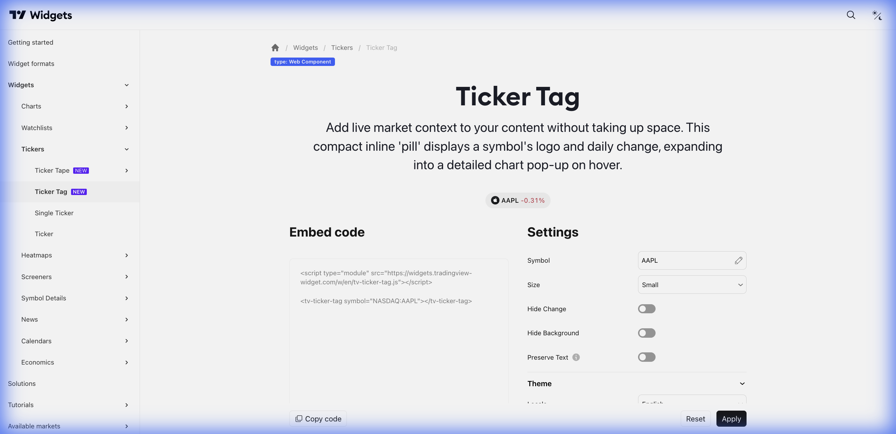

# 🏷️ Ticker Tag (Badge de Ticker)



> **Categoria:** Tickers  
> **Tipo:** Badge Compacto  
> **Script URL:** `embed-widget-ticker-tag.js`

---

## O que apresenta

O menor widget de ticker. Um badge/tag que mostra:
- Símbolo
- Preço atual
- Variação (com cor)

Ocupa espaço mínimo, ideal para inline text.

---

## Contextos de Dados Possíveis

| Contexto | Exemplo | Notas |
|----------|---------|-------|
| Qualquer ativo | PETR4, EUR/USD, BTC... | Funciona com qualquer símbolo |

---

## Casos de Uso no Lens/Terminal

```
// CONTEXTO: Dentro de texto de análise
→ "A [PETR4 R$38,50 +2,5%] está..."

// CONTEXTO: Callout de ativo em destaque
→ Badge do ativo sendo discutido

// CONTEXTO: Botões de ação rápida
→ Tags clicáveis que abrem análise

// CONTEXTO: Notificações/alertas
→ Badge do ativo que atingiu meta
```

---

## Parâmetros Principais

| Parâmetro | Tipo | Descrição |
|-----------|------|-----------|
| `symbol` | string | Símbolo do ativo |
| `colorTheme` | string | "light" ou "dark" |
| `locale` | string | Idioma |
| `isTransparent` | bool | Fundo transparente |

---

## Demo Oficial

Não possui demos específicos na documentação.

---

## Referência

[Documentação Oficial](https://www.tradingview.com/widget-docs/widgets/tickers/ticker-tag)
