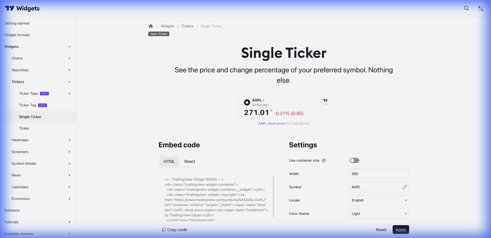

# 🎯 Single Ticker (Ticker Individual)



> **Categoria:** Tickers  
> **Tipo:** Display de Um Ativo  
> **Script URL:** `embed-widget-single-ticker.js`

---

## O que apresenta

Widget horizontal para um único ativo:
- Nome do símbolo
- Preço atual
- Variação absoluta
- Variação percentual
- Status do mercado (aberto/fechado)

Ideal para destacar um ativo específico.

---

## Contextos de Dados Possíveis

| Contexto | Exemplo | Notas |
|----------|---------|-------|
| 🇧🇷 Ações B3 | `BMFBOVESPA:PETR4` | Ação em destaque |
| 💱 Forex | `FX:USDBRL` | Cotação do dólar |
| 📊 Índices | `INDEX:IBOV` | Índice principal |
| ₿ Crypto | `BINANCE:BTCUSDT` | Bitcoin |

---

## Casos de Uso no Lens/Terminal

```
// CONTEXTO: Header de página de análise
→ Single Ticker do ativo sendo analisado

// CONTEXTO: Destaque "Ativo do Dia"
→ Single Ticker com ativo em foco

// CONTEXTO: Widget de dólar no topo
→ Single Ticker com USD/BRL sempre visível

// CONTEXTO: Barra de status
→ Single Ticker de índice (IBOV)
```

---

## Parâmetros Principais

| Parâmetro | Tipo | Descrição |
|-----------|------|-----------|
| `symbol` | string | Símbolo do ativo |
| `width` | string | Largura |
| `colorTheme` | string | "light" ou "dark" |
| `locale` | string | Idioma |
| `isTransparent` | bool | Fundo transparente |

---

## Demo Oficial

Não possui demos específicos na documentação.

---

## Referência

[Documentação Oficial](https://www.tradingview.com/widget-docs/widgets/tickers/single-ticker)
