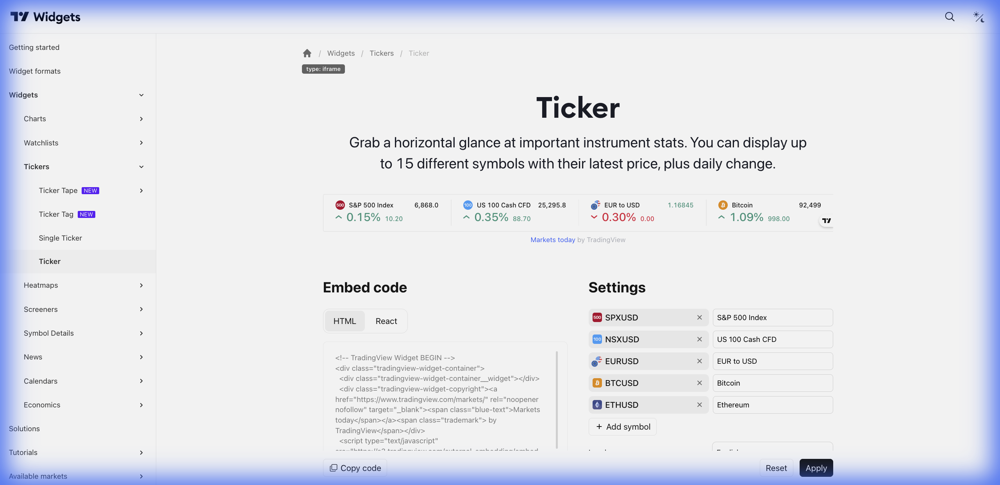

# 📊 Ticker (Widget Ticker)



> **Categoria:** Tickers  
> **Tipo:** Display de Múltiplos Ativos  
> **Script URL:** `embed-widget-ticker.js`

---

## O que apresenta

Widget de ticker que exibe múltiplos ativos em linha:
- Múltiplos símbolos lado a lado
- Preço e variação de cada um
- Formato compacto
- Não rola (diferente do Ticker Tape)

---

## Contextos de Dados Possíveis

| Contexto | Exemplo | Notas |
|----------|---------|-------|
| 🇧🇷 Ações B3 | PETR4, VALE3, ITUB4 | Top 3-5 ações |
| 📊 Índices | IBOV, S&P500, DAX | Principais índices |
| 💱 Forex | USD/BRL, EUR/BRL | Moedas em destaque |
| ₿ Crypto | BTC, ETH | Top criptos |

---

## Casos de Uso no Lens/Terminal

```
// CONTEXTO: Barra superior fixa
→ Ticker com IBOV, USD/BRL, BTC

// CONTEXTO: Resumo de carteira
→ Ticker com ativos do usuário

// CONTEXTO: Comparativo rápido
→ Ticker com 3 ações do mesmo setor
```

---

## Parâmetros Principais

| Parâmetro | Tipo | Descrição |
|-----------|------|-----------|
| `symbols` | array | Lista de símbolos |
| `colorTheme` | string | "light" ou "dark" |
| `locale` | string | Idioma |
| `isTransparent` | bool | Fundo transparente |

---

## Referência

[Documentação Oficial](https://www.tradingview.com/widget-docs/widgets/tickers/ticker)
