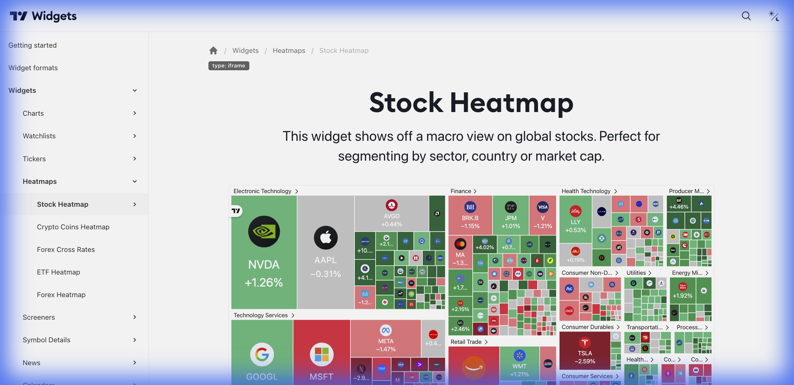

# 🔥 Stock Heatmap (Mapa de Calor de Ações)



> **Categoria:** Heatmaps  
> **Tipo:** Visualização de Mercado  
> **Script URL:** `embed-widget-stock-heatmap.js`

---

## O que apresenta

Mapa de calor visual que mostra o mercado de ações:
- Retângulos proporcionais ao market cap
- Cores indicando variação (verde = alta, vermelho = baixa)
- Agrupamento por setor
- Interativo (hover mostra detalhes)
- Clique abre gráfico

Excelente para **visão macro** do mercado.

---

## Contextos de Dados Possíveis

| Contexto | Mercado | Notas |
|----------|---------|-------|
| 🇧🇷 Brasil | B3 (IBOV) | Ações brasileiras por setor |
| 🇺🇸 EUA | S&P 500 | Ações americanas |
| 🌍 Global | Múltiplos mercados | Visão mundial |

---

## Métricas de Coloração

| Métrica | Descrição |
|---------|-----------|
| `performance` | Variação do dia |
| `relative_volume` | Volume relativo |
| `ytd_performance` | Performance no ano |
| `premarket_change` | Variação pré-mercado |

---

## Casos de Uso no Lens/Terminal

```
// CONTEXTO: Visão geral do mercado brasileiro
→ Stock Heatmap com B3, colorido por variação do dia

// CONTEXTO: Análise de setores
→ Stock Heatmap agrupado por setor (Bancos, Petróleo, Varejo)

// CONTEXTO: Volume relativo (descoberta)
→ Stock Heatmap colorido por volume relativo

// CONTEXTO: Performance YTD
→ Stock Heatmap mostrando quem subiu/caiu no ano
```

---

## Parâmetros Principais

| Parâmetro | Tipo | Descrição |
|-----------|------|-----------|
| `dataSource` | string | Fonte (ex: "SPX500", "AllBrazil") |
| `grouping` | string | Agrupamento (ex: "sector") |
| `blockSize` | string | Tamanho dos blocos |
| `blockColor` | string | Métrica de cor |
| `width` | string | Largura |
| `height` | number | Altura |
| `colorTheme` | string | "light" ou "dark" |
| `locale` | string | Idioma |

---

## Demo Oficial

- [Relative Volume](https://www.tradingview.com/widget-docs/widgets/heatmaps/stock-heatmap/demos/relative-volume)
- [YTD Index Performances](https://www.tradingview.com/widget-docs/widgets/heatmaps/stock-heatmap/demos/ytd-performance)

---

## Referência

[Documentação Oficial](https://www.tradingview.com/widget-docs/widgets/heatmaps/stock-heatmap)
