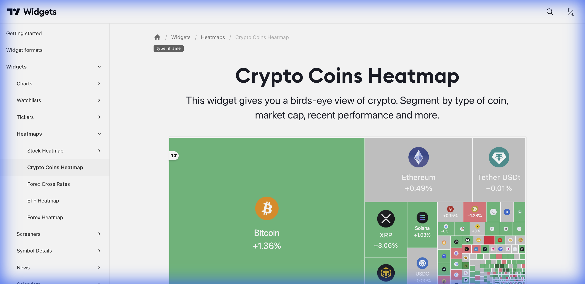

# ₿ Crypto Coins Heatmap (Mapa de Calor de Criptomoedas)



> **Categoria:** Heatmaps  
> **Tipo:** Visualização de Mercado Cripto  
> **Script URL:** `embed-widget-crypto-coins-heatmap.js`

---

## O que apresenta

Mapa de calor específico para o mercado de criptomoedas:
- Blocos proporcionais ao market cap
- Cores indicando variação
- Agrupamento por categoria (DeFi, Layer 1, Memecoins, etc.)
- Dados de todas as principais criptos

---

## Contextos de Dados Possíveis

| Contexto | Filtro | Notas |
|----------|--------|-------|
| 📊 Visão Geral | Todas as criptos | Top 100 por market cap |
| 🏦 DeFi | Tokens DeFi | Uniswap, Aave, Compound... |
| 🔗 Layer 1 | Blockchains | ETH, SOL, AVAX, ADA... |
| 🐕 Memecoins | Tokens meme | DOGE, SHIB... |
| 💰 Stablecoins | Moedas estáveis | USDT, USDC... |

---

## Casos de Uso no Lens/Terminal

```
// CONTEXTO: Visão do mercado cripto
→ Crypto Heatmap com todas as moedas

// CONTEXTO: Análise de DeFi
→ Crypto Heatmap filtrado por DeFi

// CONTEXTO: Descoberta de oportunidades
→ Crypto Heatmap colorido por volume

// CONTEXTO: Comparativo Layer 1
→ Crypto Heatmap apenas com blockchains principais
```

---

## Parâmetros Principais

| Parâmetro | Tipo | Descrição |
|-----------|------|-----------|
| `dataSource` | string | Fonte de dados |
| `blockSize` | string | Tamanho dos blocos |
| `blockColor` | string | Métrica de cor |
| `width` | string | Largura |
| `height` | number | Altura |
| `colorTheme` | string | "light" ou "dark" |
| `locale` | string | Idioma |

---

## Referência

[Documentação Oficial](https://www.tradingview.com/widget-docs/widgets/heatmaps/crypto-heatmap)
