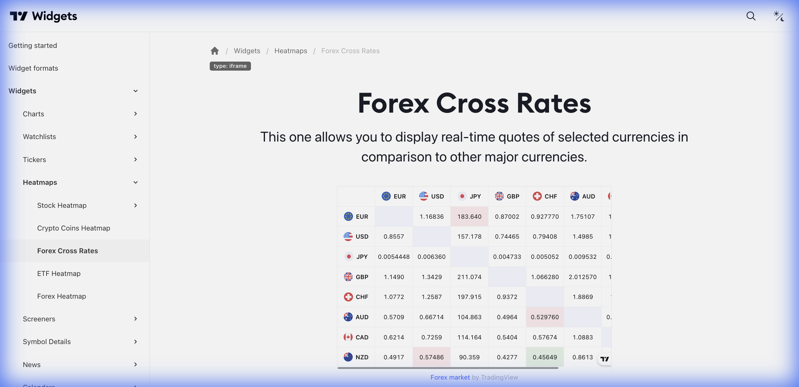

# 💱 Forex Cross Rates (Taxas Cruzadas de Câmbio)



> **Categoria:** Heatmaps  
> **Tipo:** Matriz de Moedas  
> **Script URL:** `embed-widget-forex-cross-rates.js`

---

## O que apresenta

Matriz de taxas de câmbio cruzadas:
- Todas as combinações de pares de moedas
- Cores indicando força/fraqueza relativa
- Valores de taxa de câmbio
- Atualização em tempo real

Essencial para análise de **força relativa de moedas**.

---

## Contextos de Dados Possíveis

| Contexto | Moedas | Notas |
|----------|--------|-------|
| 💱 Majors | USD, EUR, GBP, JPY, CHF | Principais moedas |
| 🌍 Emergentes | BRL, MXN, ZAR, TRY | Moedas emergentes |
| 🔀 Mix | USD, EUR, BRL, GBP | Combinação customizada |

---

## Casos de Uso no Lens/Terminal

```
// CONTEXTO: Análise de força de moedas
→ Forex Cross Rates para identificar moeda mais forte/fraca

// CONTEXTO: Produto Dólar
→ Forex Cross Rates focando em USD vs todas

// CONTEXTO: Análise de carry trade
→ Forex Cross Rates com moedas de alto yield

// CONTEXTO: Correlações de câmbio
→ Forex Cross Rates para visualizar correlações
```

---

## Parâmetros Principais

| Parâmetro | Tipo | Descrição |
|-----------|------|-----------|
| `currencies` | array | Lista de moedas a incluir |
| `width` | string | Largura |
| `height` | number | Altura |
| `colorTheme` | string | "light" ou "dark" |
| `locale` | string | Idioma |
| `isTransparent` | bool | Fundo transparente |

---

## Referência

[Documentação Oficial](https://www.tradingview.com/widget-docs/widgets/heatmaps/forex-cross-rates)
