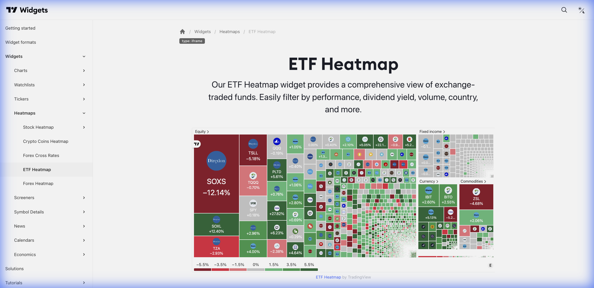

# 📦 ETF Heatmap (Mapa de Calor de ETFs)



> **Categoria:** Heatmaps  
> **Tipo:** Visualização de ETFs  
> **Script URL:** `embed-widget-etf-heatmap.js`

---

## O que apresenta

Mapa de calor para fundos de índice (ETFs):
- ETFs agrupados por categoria/setor
- Tamanho proporcional aos ativos sob gestão (AUM)
- Cores indicando performance
- Filtro por região geográfica

---

## Contextos de Dados Possíveis

| Contexto | Filtro | Notas |
|----------|--------|-------|
| 📊 Por Setor | Tech, Healthcare, Energy... | ETFs setoriais |
| 🌍 Por Região | US, Europe, Emerging | ETFs geográficos |
| 💰 Por Classe | Equity, Bond, Commodity | Classes de ativos |
| 📈 Por Estratégia | Growth, Value, Dividend | Estilos de investimento |

---

## Casos de Uso no Lens/Terminal

```
// CONTEXTO: Visão de ETFs americanos
→ ETF Heatmap com ETFs do S&P 500 setoriais

// CONTEXTO: Análise de alocação global
→ ETF Heatmap por região geográfica

// CONTEXTO: Descoberta de oportunidades em ETFs
→ ETF Heatmap colorido por performance YTD

// CONTEXTO: Produto Aluguel (Renda Fixa)
→ ETF Heatmap focado em Bond ETFs
```

---

## Parâmetros Principais

| Parâmetro | Tipo | Descrição |
|-----------|------|-----------|
| `dataSource` | string | Fonte de dados |
| `width` | string | Largura |
| `height` | number | Altura |
| `colorTheme` | string | "light" ou "dark" |
| `locale` | string | Idioma |

---

## Referência

[Documentação Oficial](https://www.tradingview.com/widget-docs/widgets/heatmaps/etf-heatmap)
