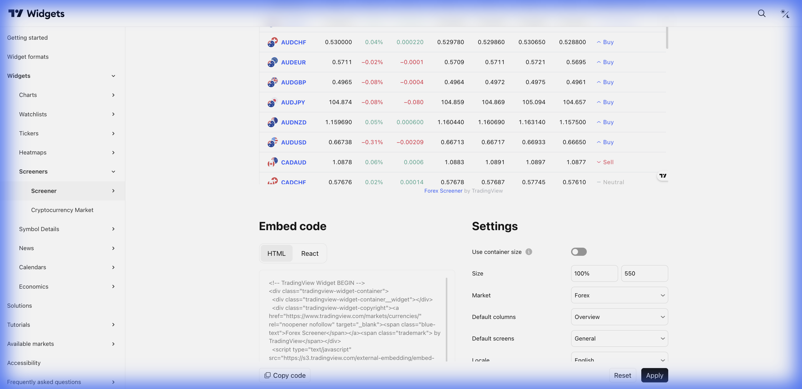

# 🔎 Screener (Filtro de Ativos)



> **Categoria:** Screeners  
> **Tipo:** Tabela com Filtros  
> **Script URL:** `embed-widget-screener.js`

---

## O que apresenta

Ferramenta de filtragem de ativos com:
- Tabela de resultados em tempo real
- Filtros por múltiplos critérios
- Ordenação por coluna
- Dados fundamentalistas e técnicos
- Clique para abrir gráfico

É o **motor de busca** de ativos.

---

## Contextos de Dados Possíveis

| Contexto | Mercado | Notas |
|----------|---------|-------|
| 🇧🇷 Ações B3 | brazil | Ações brasileiras |
| 🇺🇸 Ações EUA | america | Ações americanas |
| 💱 Forex | forex | Pares de moedas |
| ₿ Crypto | crypto | Criptomoedas |
| 🌍 Global | Múltiplos | Todas as bolsas |

---

## Critérios de Filtro Disponíveis

| Categoria | Exemplos |
|-----------|----------|
| Técnicos | RSI, MACD, Médias Móveis, Volume |
| Fundamentalistas | P/E, P/B, Dividend Yield, Market Cap |
| Performance | Variação 1D, 1W, 1M, YTD |
| Osciladores | Sobrecomprado, Sobrevendido |

---

## Casos de Uso no Lens/Terminal

```
// CONTEXTO: Radar - buscar ações com alto dividendo
→ Screener filtrado por Dividend Yield > 6%

// CONTEXTO: Descoberta - momentum stocks
→ Screener ordenado por variação 1M (maiores altas)

// CONTEXTO: Value investing
→ Screener com P/E < 10 e P/B < 1

// CONTEXTO: Análise técnica
→ Screener com RSI < 30 (sobrevendido)

// CONTEXTO: Produto Vitalícia
→ Screener pré-configurado com critérios do produto
```

---

## Parâmetros Principais

| Parâmetro | Tipo | Descrição |
|-----------|------|-----------|
| `defaultScreen` | string | Tela padrão (stock, forex, crypto) |
| `defaultColumn` | string | Coluna de ordenação padrão |
| `market` | string | Mercado (brazil, america, etc.) |
| `width` | string | Largura |
| `height` | number | Altura |
| `colorTheme` | string | "light" ou "dark" |
| `locale` | string | Idioma |
| `showToolbar` | bool | Mostrar barra de ferramentas |
| `largeChartUrl` | string | URL ao clicar |

---

## Demo Oficial

- [Stock](https://www.tradingview.com/widget-docs/widgets/screeners/screener/demos/stock)
- [Forex](https://www.tradingview.com/widget-docs/widgets/screeners/screener/demos/forex)
- [Crypto Pairs](https://www.tradingview.com/widget-docs/widgets/screeners/screener/demos/crypto-pairs)

---

## Referência

[Documentação Oficial](https://www.tradingview.com/widget-docs/widgets/screeners/screener)
