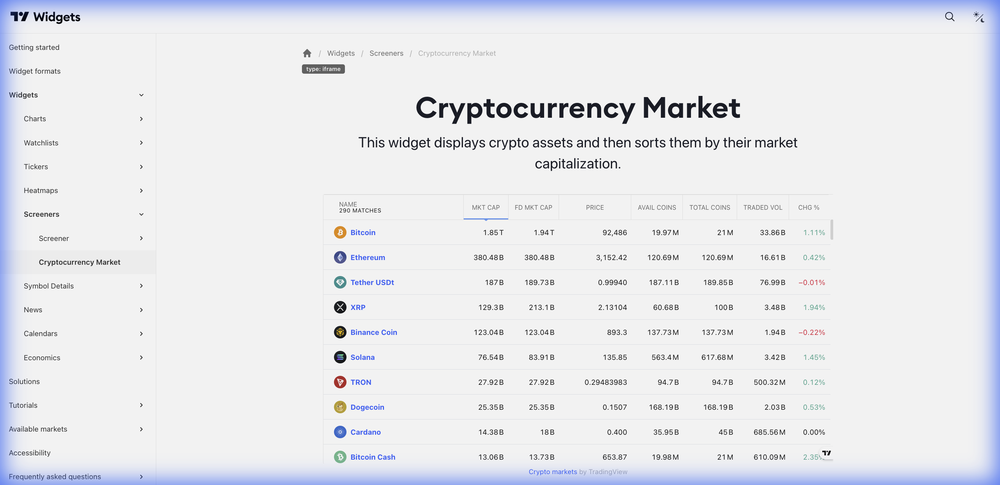

# ₿ Cryptocurrency Market (Mercado de Criptomoedas)



> **Categoria:** Screeners  
> **Tipo:** Screener Especializado em Cripto  
> **Script URL:** `embed-widget-crypto-mkt-screener.js`

---

## O que apresenta

Screener dedicado ao mercado de criptomoedas:
- Tabela com todas as criptomoedas
- Métricas específicas de cripto (Market Cap, Volume, Circulante)
- Filtros por exchange, categoria
- Ordenação por múltiplos critérios
- Dados em tempo real

---

## Contextos de Dados Possíveis

| Contexto | Filtro | Notas |
|----------|--------|-------|
| 📊 Top Coins | Por Market Cap | Top 100 criptos |
| 💹 Movers | Por Volume 24h | Mais negociadas |
| 🆕 New Listings | Por data | Lançamentos recentes |
| 🔥 Trending | Por Performance | Maiores altas/quedas |

---

## Casos de Uso no Lens/Terminal

```
// CONTEXTO: Visão geral do mercado cripto
→ Crypto Market Screener ordenado por Market Cap

// CONTEXTO: Descoberta de oportunidades
→ Crypto Market Screener filtrado por performance 24h

// CONTEXTO: Análise de volume
→ Crypto Market Screener ordenado por volume

// CONTEXTO: DeFi tokens
→ Crypto Market Screener filtrado por categoria DeFi
```

---

## Parâmetros Principais

| Parâmetro | Tipo | Descrição |
|-----------|------|-----------|
| `width` | string | Largura |
| `height` | number | Altura |
| `colorTheme` | string | "light" ou "dark" |
| `locale` | string | Idioma |
| `defaultColumn` | string | Coluna padrão |
| `largeChartUrl` | string | URL ao clicar |

---

## Referência

[Documentação Oficial](https://www.tradingview.com/widget-docs/widgets/screeners/crypto-mkt-screener)
