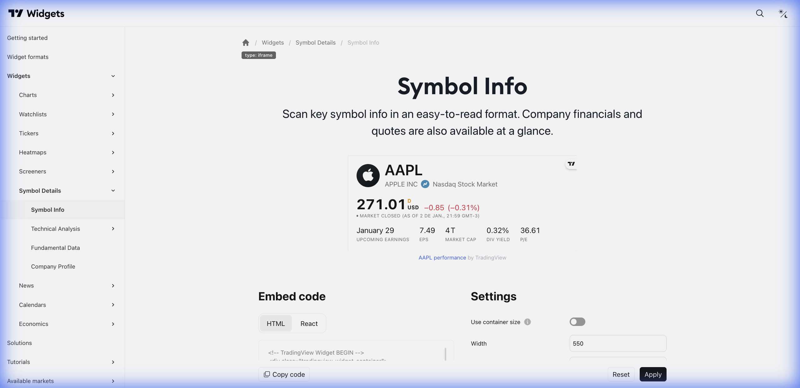

# ℹ️ Symbol Info (Informações do Símbolo)



> **Categoria:** Symbol Details  
> **Tipo:** Header Informativo  
> **Script URL:** `embed-widget-symbol-info.js`

---

## O que apresenta

Widget de cabeçalho com informações essenciais do ativo:
- Nome completo e ticker
- Preço atual
- Variação (% e absoluta)
- Range do dia (máx/mín)
- Volume
- Status do mercado

Ideal para **header** de páginas de análise.

---

## Contextos de Dados Possíveis

| Contexto | Exemplo | Notas |
|----------|---------|-------|
| 🇧🇷 Ações B3 | BMFBOVESPA:PETR4 | Ações brasileiras |
| 🇺🇸 Ações EUA | NASDAQ:AAPL | Ações americanas |
| 💱 Forex | FX:USDBRL | Pares de moedas |
| ₿ Crypto | BINANCE:BTCUSDT | Criptomoedas |
| 📊 Índices | INDEX:IBOV | Índices |

---

## Casos de Uso no Lens/Terminal

```
// CONTEXTO: Header da página de análise
→ Symbol Info no topo com o ativo sendo analisado

// CONTEXTO: Detalhe de ativo no Radar
→ Symbol Info como header do overlay

// CONTEXTO: Página de aula (Aprender)
→ Symbol Info mostrando exemplo do ativo da aula

// CONTEXTO: Terminal - resposta com ativo
→ Symbol Info no início do painel gerado
```

---

## Parâmetros Principais

| Parâmetro | Tipo | Descrição |
|-----------|------|-----------|
| `symbol` | string | Símbolo do ativo |
| `width` | string | Largura |
| `colorTheme` | string | "light" ou "dark" |
| `locale` | string | Idioma |
| `isTransparent` | bool | Fundo transparente |

---

## Referência

[Documentação Oficial](https://www.tradingview.com/widget-docs/widgets/symbol-details/symbol-info)
