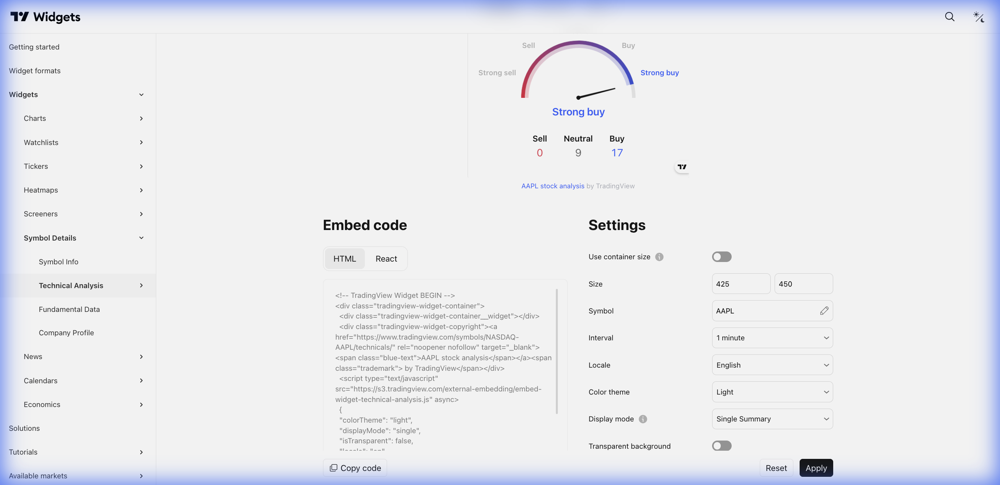

# 📊 Technical Analysis (Análise Técnica)



> **Categoria:** Symbol Details  
> **Tipo:** Gauge de Sinais  
> **Script URL:** `embed-widget-technical-analysis.js`

---

## O que apresenta

Widget de análise técnica que mostra:
- Gauge (velocímetro) com sinal de compra/venda/neutro
- Resumo de osciladores
- Resumo de médias móveis
- Múltiplos timeframes
- Detalhamento de indicadores

É o **resumo visual** da análise técnica.

---

## Contextos de Dados Possíveis

| Contexto | Exemplo | Notas |
|----------|---------|-------|
| 🇧🇷 Ações B3 | BMFBOVESPA:VALE3 | Sinais para ações BR |
| 💱 Forex | FX:EURUSD | Sinais para moedas |
| ₿ Crypto | BINANCE:ETHUSDT | Sinais para cripto |
| 📊 Índices | TVC:SPX | Sinais para índices |

---

## Timeframes Disponíveis

| Intervalo | Código | Uso |
|-----------|--------|-----|
| 1 minuto | 1 | Scalping |
| 5 minutos | 5 | Day trade |
| 15 minutos | 15 | Intraday |
| 1 hora | 60 | Swing curto |
| 4 horas | 240 | Swing médio |
| 1 dia | 1D | Position |
| 1 semana | 1W | Longo prazo |
| 1 mês | 1M | Macro |

---

## Casos de Uso no Lens/Terminal

```
// CONTEXTO: Página de análise - seção técnica
→ Technical Analysis gauge com múltiplos timeframes

// CONTEXTO: Resumo rápido de ativo
→ Technical Analysis em formato compacto

// CONTEXTO: Comparativo de sinais
→ Múltiplos gauges lado a lado (PETR4, VALE3, ITUB4)

// CONTEXTO: Educacional - explicar indicadores
→ Technical Analysis com detalhamento expandido
```

---

## Parâmetros Principais

| Parâmetro | Tipo | Descrição |
|-----------|------|-----------|
| `symbol` | string | Símbolo do ativo |
| `interval` | string | Timeframe (ex: "1D") |
| `width` | string | Largura |
| `height` | number | Altura |
| `colorTheme` | string | "light" ou "dark" |
| `locale` | string | Idioma |
| `isTransparent` | bool | Fundo transparente |
| `showIntervalTabs` | bool | Mostrar abas de timeframe |
| `displayMode` | string | "single" ou "multiple" |

---

## Demo Oficial

- [Multiple Gauges](https://www.tradingview.com/widget-docs/widgets/symbol-details/technical-analysis/demos/multiple)
- [Single Gauge](https://www.tradingview.com/widget-docs/widgets/symbol-details/technical-analysis/demos/single)

---

## Referência

[Documentação Oficial](https://www.tradingview.com/widget-docs/widgets/symbol-details/technical-analysis)
