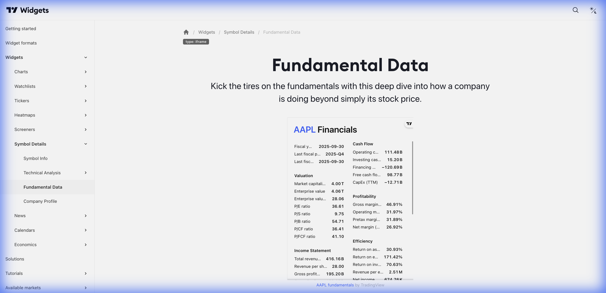

# 📈 Fundamental Data (Dados Fundamentalistas)



> **Categoria:** Symbol Details  
> **Tipo:** Demonstrativos Financeiros  
> **Script URL:** `embed-widget-financials.js`

---

## O que apresenta

Widget completo de dados fundamentalistas:
- Demonstrativo de resultados (Income Statement)
- Balanço patrimonial (Balance Sheet)
- Fluxo de caixa (Cash Flow)
- Métricas de valuation
- Dados históricos (trimestral/anual)

Essencial para **análise fundamentalista**.

---

## Contextos de Dados Possíveis

| Contexto | Exemplo | Notas |
|----------|---------|-------|
| 🇧🇷 Ações B3 | BMFBOVESPA:PETR4 | Dados de empresas BR |
| 🇺🇸 Ações EUA | NASDAQ:AAPL | Dados de empresas US |
| 🌍 Global | Qualquer ação | Dados financeiros |

> **Nota:** Disponível apenas para ações. Não disponível para Forex, Cripto ou Índices.

---

## Dados Disponíveis

| Categoria | Métricas |
|-----------|----------|
| Valuation | P/E, P/B, P/S, EV/EBITDA |
| Rentabilidade | ROE, ROA, Margem Líquida |
| Crescimento | Receita, Lucro, EPS |
| Dividendos | Dividend Yield, Payout |
| Endividamento | Dívida/PL, Cobertura de juros |

---

## Casos de Uso no Lens/Terminal

```
// CONTEXTO: Análise fundamentalista completa
→ Fundamental Data com todos os demonstrativos

// CONTEXTO: Comparativo de métricas
→ Fundamental Data focado em valuation (P/E, P/B)

// CONTEXTO: Análise de dividendos
→ Fundamental Data focado em payout e yield

// CONTEXTO: Aula sobre balanço
→ Fundamental Data com balanço expandido
```

---

## Parâmetros Principais

| Parâmetro | Tipo | Descrição |
|-----------|------|-----------|
| `symbol` | string | Símbolo do ativo |
| `width` | string | Largura |
| `height` | number | Altura |
| `colorTheme` | string | "light" ou "dark" |
| `locale` | string | Idioma |
| `isTransparent` | bool | Fundo transparente |
| `displayMode` | string | "regular" ou "compact" |

---

## Referência

[Documentação Oficial](https://www.tradingview.com/widget-docs/widgets/symbol-details/fundamental-data)
