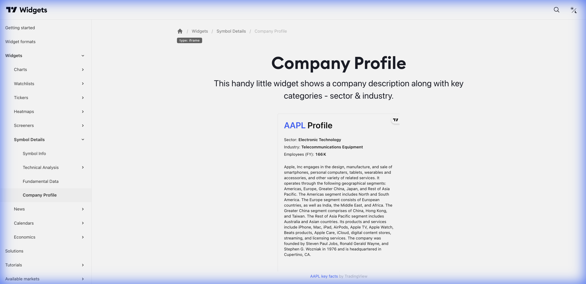

# 🏢 Company Profile (Perfil da Empresa)



> **Categoria:** Symbol Details  
> **Tipo:** Informações Institucionais  
> **Script URL:** `embed-widget-symbol-profile.js`

---

## O que apresenta

Perfil institucional da empresa:
- Descrição da empresa
- Setor e indústria
- Número de funcionários
- País e sede
- CEO e diretoria
- Website

Complemento ideal para **contexto do negócio**.

---

## Contextos de Dados Possíveis

| Contexto | Exemplo | Notas |
|----------|---------|-------|
| 🇧🇷 Ações B3 | BMFBOVESPA:VALE3 | Empresas brasileiras |
| 🇺🇸 Ações EUA | NYSE:KO | Empresas americanas |
| 🌍 Global | Qualquer ação | Perfil institucional |

> **Nota:** Disponível apenas para ações. Não disponível para Forex, Cripto ou Índices.

---

## Casos de Uso no Lens/Terminal

```
// CONTEXTO: "O que a Petrobras faz?"
→ Company Profile com descrição completa

// CONTEXTO: Página de análise - seção "Sobre"
→ Company Profile como bloco informativo

// CONTEXTO: Comparativo de empresas
→ Company Profile lado a lado de concorrentes

// CONTEXTO: Educacional - entender o setor
→ Company Profile focando em setor/indústria
```

---

## Parâmetros Principais

| Parâmetro | Tipo | Descrição |
|-----------|------|-----------|
| `symbol` | string | Símbolo do ativo |
| `width` | string | Largura |
| `height` | number | Altura |
| `colorTheme` | string | "light" ou "dark" |
| `locale` | string | Idioma |
| `isTransparent` | bool | Fundo transparente |

---

## Referência

[Documentação Oficial](https://www.tradingview.com/widget-docs/widgets/symbol-details/company-profile)
