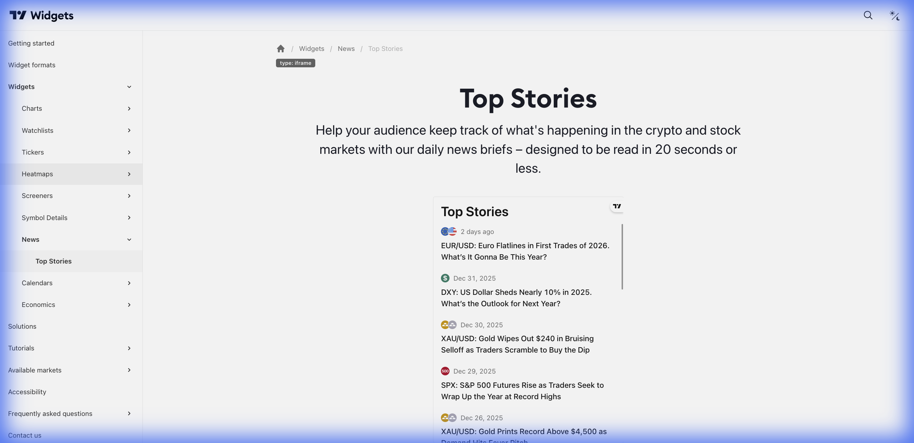

# 📰 Top Stories (Notícias Principais)



> **Categoria:** News  
> **Tipo:** Feed de Notícias  
> **Script URL:** `embed-widget-timeline.js`

---

## O que apresenta

Feed de notícias financeiras em tempo real:
- Headlines de notícias
- Timestamp
- Fonte
- Link para artigo completo
- Filtrável por símbolo/mercado

Mantém o usuário **informado** sobre eventos do mercado.

---

## Contextos de Dados Possíveis

| Contexto | Filtro | Notas |
|----------|--------|-------|
| 📊 Mercado Geral | Sem filtro | Todas as notícias |
| 🇧🇷 Brasil | IBOV/B3 | Notícias do mercado BR |
| 🏢 Por Ativo | PETR4, VALE3... | Notícias específicas |
| 💱 Forex | FX | Notícias de câmbio |
| ₿ Crypto | Crypto | Notícias de cripto |

---

## Casos de Uso no Lens/Terminal

```
// CONTEXTO: Feed no app - seção "Últimas"
→ Top Stories com notícias gerais do mercado

// CONTEXTO: Página de análise - seção notícias
→ Top Stories filtrado pelo ativo sendo analisado

// CONTEXTO: Tela de descoberta
→ Top Stories com headlines de destaque

// CONTEXTO: Alertas de mercado
→ Top Stories com notícias relevantes
```

---

## Parâmetros Principais

| Parâmetro | Tipo | Descrição |
|-----------|------|-----------|
| `feedMode` | string | Modo do feed |
| `market` | string | Mercado para filtrar |
| `symbol` | string | Símbolo específico (opcional) |
| `width` | string | Largura |
| `height` | number | Altura |
| `colorTheme` | string | "light" ou "dark" |
| `locale` | string | Idioma |
| `isTransparent` | bool | Fundo transparente |

---

## Referência

[Documentação Oficial](https://www.tradingview.com/widget-docs/widgets/news/top-stories)
