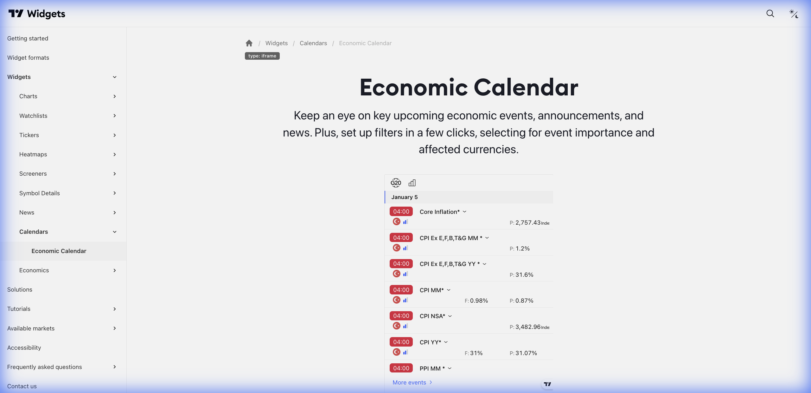

# 📅 Economic Calendar (Calendário Econômico)



> **Categoria:** Calendars  
> **Tipo:** Eventos Macroeconômicos  
> **Script URL:** `embed-widget-events.js`

---

## O que apresenta

Calendário de eventos econômicos:
- Indicadores econômicos (PIB, Inflação, Emprego...)
- Decisões de juros de bancos centrais
- Divulgação de balanços
- Horário e importância
- Valores esperados vs reais
- Impacto de mercado (alto/médio/baixo)

Essencial para **planejamento e contexto macro**.

---

## Contextos de Dados Possíveis

| Contexto | Filtro | Notas |
|----------|--------|-------|
| 🌍 Global | Todos os países | Eventos mundiais |
| 🇧🇷 Brasil | BR | Eventos brasileiros |
| 🇺🇸 EUA | US | Eventos americanos |
| 🇪🇺 Europa | EU | Eventos europeus |
| ⚡ Alto Impacto | Importance: High | Apenas eventos importantes |

---

## Tipos de Eventos

| Categoria | Exemplos |
|-----------|----------|
| Juros | Decisão COPOM, Fed Funds, BCE |
| Emprego | Payroll, Taxa de desemprego |
| Inflação | IPCA, CPI, Core CPI |
| PIB | Produto Interno Bruto |
| Confiança | PMI, Confiança do consumidor |
| Balanços | Earnings de empresas |

---

## Casos de Uso no Lens/Terminal

```
// CONTEXTO: "O que tem de importante essa semana?"
→ Economic Calendar com eventos da semana

// CONTEXTO: Planejamento de operações
→ Economic Calendar mostrando eventos de alto impacto

// CONTEXTO: Acompanhamento COPOM
→ Economic Calendar filtrado por Brasil

// CONTEXTO: Preparação para earnings
→ Economic Calendar com divulgações de balanço
```

---

## Parâmetros Principais

| Parâmetro | Tipo | Descrição |
|-----------|------|-----------|
| `width` | string | Largura |
| `height` | number | Altura |
| `colorTheme` | string | "light" ou "dark" |
| `locale` | string | Idioma |
| `isTransparent` | bool | Fundo transparente |
| `importanceFilter` | string | Filtro de importância |
| `currencyFilter` | array | Filtro por país/moeda |

---

## Referência

[Documentação Oficial](https://www.tradingview.com/widget-docs/widgets/calendars/economic-calendar)
