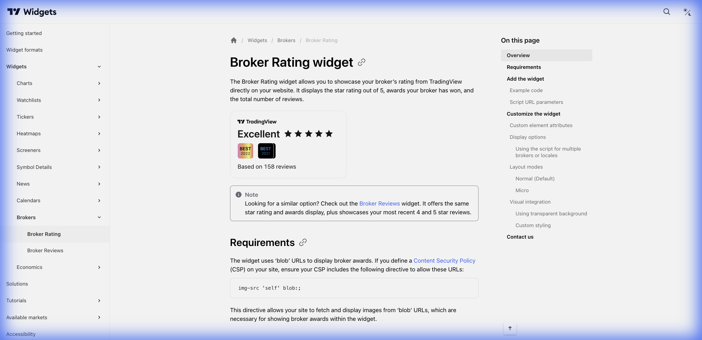

# ⭐ Broker Rating (Avaliação de Corretoras)



> **Categoria:** Brokers  
> **Tipo:** Comparativo de Corretoras  
> **Script URL:** `embed-widget-broker-rating.js`

---

## O que apresenta

Comparativo e avaliação de corretoras:
- Rating geral (1-5 estrelas)
- Avaliação por categoria
- Número de reviews
- Link para reviews completas

Útil para **monetização** e **parcerias com corretoras**.

---

## Contextos de Dados Possíveis

| Contexto | Filtro | Notas |
|----------|--------|-------|
| 📊 Por Popularidade | Mais avaliadas | Top brokers |
| ⭐ Por Rating | Melhor avaliadas | Qualidade |
| 🌍 Por Região | País/região | Brokers locais |

---

## Casos de Uso no Lens/Terminal

```
// CONTEXTO: Seção "Onde operar?"
→ Broker Rating com corretoras parceiras

// CONTEXTO: Comparativo de custos
→ Broker Rating filtrando por categoria "fees"

// CONTEXTO: Artigo educacional sobre corretoras
→ Broker Rating como referência

// CONTEXTO: CTA para abertura de conta (affiliate)
→ Broker Rating com call-to-action
```

---

## Parâmetros Principais

| Parâmetro | Tipo | Descrição |
|-----------|------|-----------|
| `width` | string | Largura |
| `height` | number | Altura |
| `colorTheme` | string | "light" ou "dark" |
| `locale` | string | Idioma |

---

## Nota de Monetização

Este widget pode ser usado para:
- Parcerias de afiliados
- Recomendação de corretoras
- Links de referral

---

## Referência

[Documentação Oficial](https://www.tradingview.com/widget-docs/widgets/brokers/rating)
