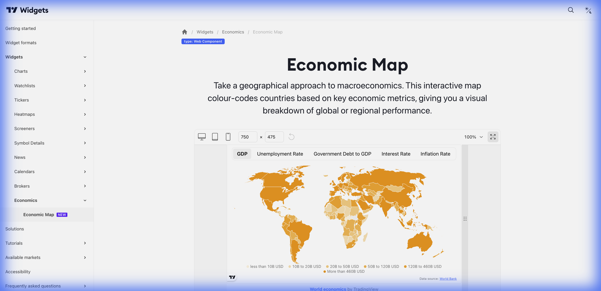

# 🌍 Economic Map (Mapa Econômico)



> **Categoria:** Economics  
> **Tipo:** Mapa Global de Indicadores  
> **Script URL:** `embed-widget-economic-map.js`

---

## O que apresenta

Mapa mundial interativo com indicadores econômicos:
- Países coloridos por métrica (PIB, Inflação, Juros...)
- Hover mostra dados detalhados
- Múltiplos indicadores disponíveis
- Dados de todos os países

Excelente para **visão macro global**.

---

## Indicadores Disponíveis

| Indicador | Descrição |
|-----------|-----------|
| GDP Growth | Crescimento do PIB |
| Inflation Rate | Taxa de inflação |
| Interest Rate | Taxa de juros |
| Unemployment | Taxa de desemprego |
| Government Debt | Dívida pública |
| Trade Balance | Balança comercial |
| Current Account | Conta corrente |

---

## Contextos de Dados Possíveis

| Contexto | Indicador | Notas |
|----------|-----------|-------|
| 📈 Crescimento | GDP Growth | Economias em expansão |
| 📉 Inflação | Inflation Rate | Pressão de preços |
| 🏦 Juros | Interest Rate | Política monetária |
| 💼 Emprego | Unemployment | Saúde do mercado de trabalho |

---

## Casos de Uso no Lens/Terminal

```
// CONTEXTO: "Quais países estão crescendo mais?"
→ Economic Map com GDP Growth

// CONTEXTO: Análise de inflação global
→ Economic Map com Inflation Rate

// CONTEXTO: Comparativo de juros para carry trade
→ Economic Map com Interest Rates

// CONTEXTO: Educacional sobre macroeconomia
→ Economic Map interativo com múltiplos indicadores
```

---

## Parâmetros Principais

| Parâmetro | Tipo | Descrição |
|-----------|------|-----------|
| `width` | string | Largura |
| `height` | number | Altura |
| `colorTheme` | string | "light" ou "dark" |
| `locale` | string | Idioma |
| `indicatorTop` | string | Indicador exibido |

---

## Referência

[Documentação Oficial](https://www.tradingview.com/widget-docs/widgets/economics/economic-map)
